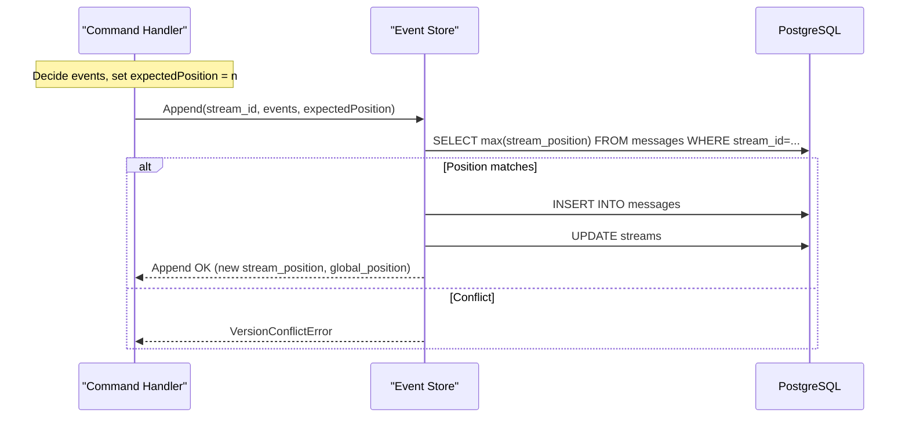
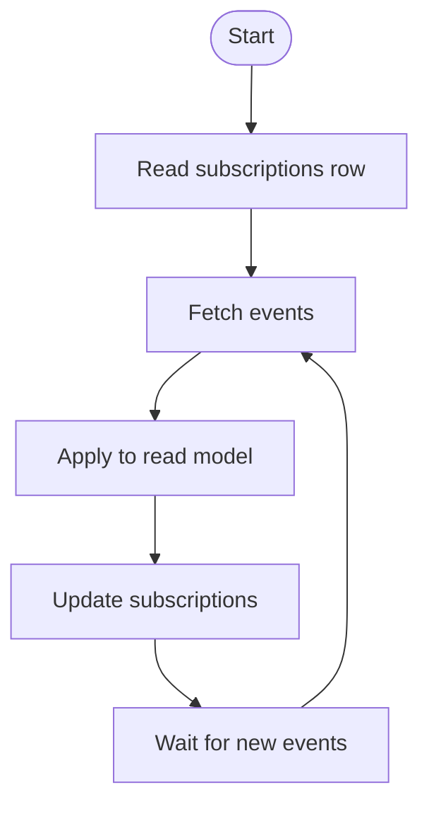

# Event Sourcing Project Example

## Event Sourcing with Emmett

[Emmett](https://event-driven-io.github.io/emmett/) is a library that helps developing an event sourced system.

## Event Sourcing Database Schema

The following are the tables used for building Event Sourcing module.

### Streams table

| Column          | Type    | Nullable | Default          | Notes               |
| --------------- | ------- | -------- | ---------------- | ------------------- |
| stream_id       | TEXT    | NO       |                  |                     |
| stream_position | BIGINT  | NO       |                  |                     |
| partition       | TEXT    | NO       | '${customer_id}' | Partition key value |
| stream_type     | TEXT    | NO       |                  |                     |
| stream_metadata | JSONB   | NO       |                  |                     |
| is_archived     | BOOLEAN | NO       | FALSE            |                     |

- Primary key: `(stream_id, partition, is_archived)`
- Partitioning: `PARTITION BY LIST (partition)`
- Indexes: Unique index on `(stream_id, partition, is_archived)` including `stream_position`

### Messages table

| Column                 | Type        | Nullable | Default                                | Notes                 |
| ---------------------- | ----------- | -------- | -------------------------------------- | --------------------- |
| stream_id              | TEXT        | NO       |                                        |                       |
| stream_position        | BIGINT      | NO       |                                        |                       |
| partition              | TEXT        | NO       | '${customer_id}'                       | Partition key value   |
| message_kind           | CHAR(1)     | NO       | 'E'                                    |                       |
| message_data           | JSONB       | NO       |                                        |                       |
| message_metadata       | JSONB       | NO       |                                        |                       |
| message_schema_version | TEXT        | NO       |                                        |                       |
| message_type           | TEXT        | NO       |                                        |                       |
| message_id             | TEXT        | NO       |                                        |                       |
| is_archived            | BOOLEAN     | NO       | FALSE                                  |                       |
| global_position        | BIGINT      | YES      | nextval('emt_global_message_position') | Monotonic sequence    |
| transaction_id         | XID8        | NO       |                                        | PostgreSQL 64-bit XID |
| created                | TIMESTAMPTZ | NO       | now()                                  |                       |

- Primary key: `(stream_id, stream_position, partition, is_archived)`
- Partitioning: `PARTITION BY LIST (partition)`
- Sequences: `emt_global_message_position` (used by `global_position`)

### Subscriptions table

| Column                        | Type   | Nullable | Default          | Notes                 |
| ----------------------------- | ------ | -------- | ---------------- | --------------------- |
| subscription_id               | TEXT   | NO       |                  |                       |
| version                       | INT    | NO       | 1                | Part of PK            |
| partition                     | TEXT   | NO       | '${customer_id}' | Partition key value   |
| last_processed_position       | BIGINT | NO       |                  |                       |
| last_processed_transaction_id | XID8   | NO       |                  | PostgreSQL 64-bit XID |

- Primary key: `(subscription_id, partition, version)`
- Partitioning: `PARTITION BY LIST (partition)`

## Event Sourcing (writes)

The tables above implement Emmett's event store for PostgreSQL. See the Emmett documentation for an overview: [Emmett overview](https://event-driven-io.github.io/emmett/overview.html).

### How writes work (commands → events)

- A command handler decides on changes and records them as immutable events.
- Events are appended to a stream identified by `stream_id`.
- Each append increments `stream_position` within that stream. This enables optimistic concurrency checks (compare expected position before writing).
- A row in `messages` is written per event.
- `global_position` is assigned from a sequence to provide a monotonic, cross-stream ordering for consumers.
- The `streams` table tracks the stream's type, latest position and metadata for quick access and listing.

### Partitions and archiving

- `partition` is a logical partition key. It is used for multi-tenancy.
- Both `streams` and `messages` include `is_archived`. Archiving allows hiding historical streams/messages without deleting rows and is part of the primary key, preserving history.

### Diagrams (writes)

#### Stream append with optimistic concurrency



## Event Sourcing (reads)

### How reads and projections work (subscriptions)

- Projections/read models consume events in `messages`, typically by increasing `global_position`.
- Each projection keeps its cursor in `subscriptions` as `last_processed_position` (and `last_processed_transaction_id`) so it can resume after restarts.
- Processing flow:
  1. Load next batch of events where `global_position` > `last_processed_position`.
  2. Apply events to your read model store (e.g., PostgreSQL tables, Elasticsearch, caches).
  3. Update the corresponding row in `subscriptions` to the last successfully processed position.
- Using the position bookmark ensures at-least-once processing with idempotent projections. The transaction id helps detect boundary cases around transaction visibility.

### Diagrams (reads)

#### Projection subscription loop



## Shopping Cart Example

This example demonstrates an event-sourced shopping cart implementation using the Emmett framework. The cart follows CQRS and Event Sourcing patterns with clear separation between commands, events, and domain states.

### Commands

Commands represent the intent to perform an action on the cart:

| Command | Description | Parameters |
|---|---|---|
| CreateCart | Initializes a new shopping cart | tenantId, cartId, currency |
| AddItemToCart | Adds an item to the cart | tenantId, cartId, item (sku, quantity, price) |
| RemoveItemFromCart | Removes a specific quantity of an item | tenantId, cartId, sku, quantity |
| CartEmptied | Empties all items from the cart | tenantId, cartId |
| CartCheckedOut | Completes the cart checkout process | tenantId, cartId, orderId, total |
| CartCancelled | Cancels the cart with a reason | tenantId, cartId, reason |

### Events

Events represent what has happened in the system and are immutable:

| Event | Description | Data |
|---|---|---|
| CartCreated | Cart has been initialized | currency |
| ItemAddedToCart | An item was added to the cart | item (sku, quantity, price) |
| ItemRemovedFromCart | An item was removed from the cart | sku, quantity |
| CartEmptied | All items were removed from the cart | null |
| CartCheckedOut | Cart checkout was completed | orderId, total |
| CartCancelled | Cart was cancelled | reason |

### Domain States

The cart can exist in different states throughout its lifecycle:

| State | Description | Properties |
|---|---|---|
| InitCart | Initial state before cart creation | status: "init", items: [] |
| ActiveCart | Cart is active and can be modified | status: "active", tenantId, cartId, currency, items |
| CheckedOutCart | Cart has been checked out | status: "checkedOut", tenantId, cartId, currency, items |
| CancelledCart | Cart has been cancelled | status: "cancelled", tenantId, cartId, currency, items |

### State Transitions

```
InitCart → ActiveCart (via CartCreated)
ActiveCart → ActiveCart (via ItemAddedToCart, ItemRemovedFromCart, CartEmptied)
ActiveCart → CheckedOutCart (via CartCheckedOut)
ActiveCart → CancelledCart (via CartCancelled)
```

### Business Rules

- Only positive quantities are allowed for items
- Cannot remove more items than exist in the cart
- Cannot modify a cart that has been checked out or cancelled
- Total amount cannot be negative during checkout
- All operations require valid tenantId and cartId

### Data Example

When the following events occur:

1. Cart created
2. An item added (SKU-123 x2 @ $25)
3. Another item added (SKU-456 x1 @ $15)
4. The first item removed (SKU-123 x1)
5. Checkout the cart

"Writes" inserts/updates to the following tables.

#### `messages` table

| message_data | message_type |
|---|---|
| CartCreated         | {"currency": "USD"}                                                               |
| ItemAddedToCart     | {"item": {"sku": "SKU-123", "name": "Item 123", "quantity": 2, "unitPrice": 25}}  |
| ItemAddedToCart     | {"item": {"sku": "SKU-456", "name": "Item 456", "quantity": 1, "unitPrice": 15}}  |
| ItemRemovedFromCart | {"sku": "SKU-123", "quantity": 1}                                                 |
| CartCheckedOut      | {"total": 40, "orderId": "38fc43c4-893d-4398-9290-2441490d0545"}                  |

#### `streams` table

| stream_id | stream_position | stream_type |
|---|---|---|
| de9f2d24-2475-49dc-88d7-652028650204 | 5| cart|

Then, "Reads" inserts into the following table. `subscription_id` contains what executed the projection.

#### `subscriptions` table

| subscription_id | last_processed_position |
|---|---|
| carts-read-model:de9f2d24-2475-49dc-88d7-652028650204 | 5 |

#### `carts` table (projected data)

| cart_id | currency | items_json |
|---|---|---|
| de9f2d24-2475-49dc-88d7-652028650204 | USD      | {"items": [{"sku": "SKU-123", "name": "Item 123", "quantity": 1, "unitPrice": 25}, {"sku": "SKU-456", "name": "Item 456", "quantity": 1, "unitPrice": 15}], "total": 40, "orderId": "38fc43c4-893d-4398-9290-2441490d0545"} |

##### Notes

As long as you only touch the domain business logic, you would not need to worry about the `streams` table and the `subscriptions` table. Those are the system tables to store the internal states.
